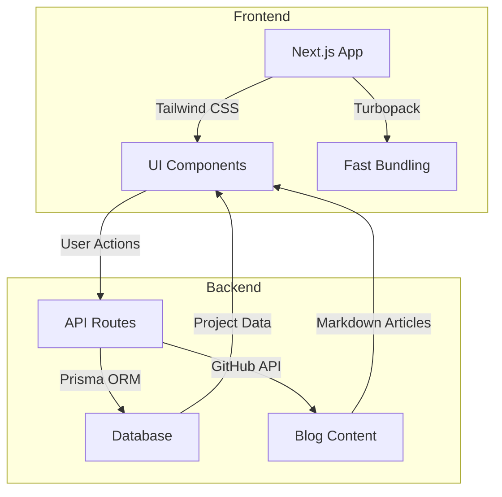
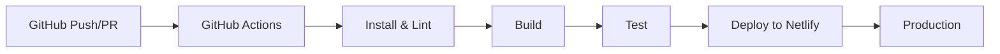
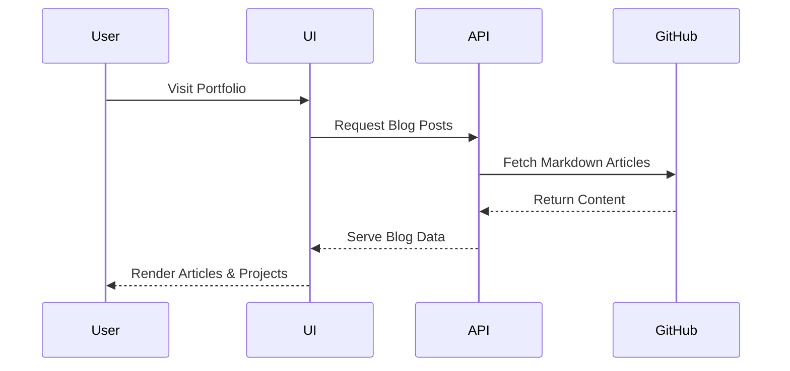
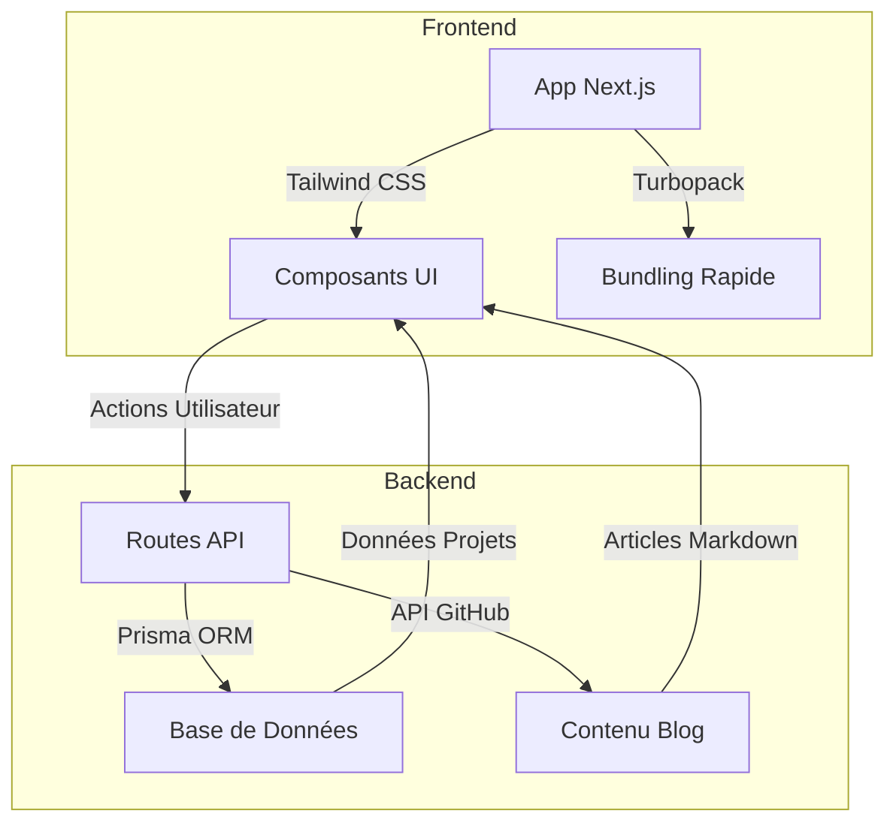
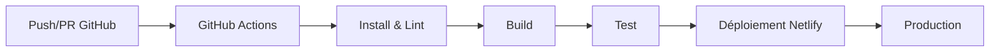
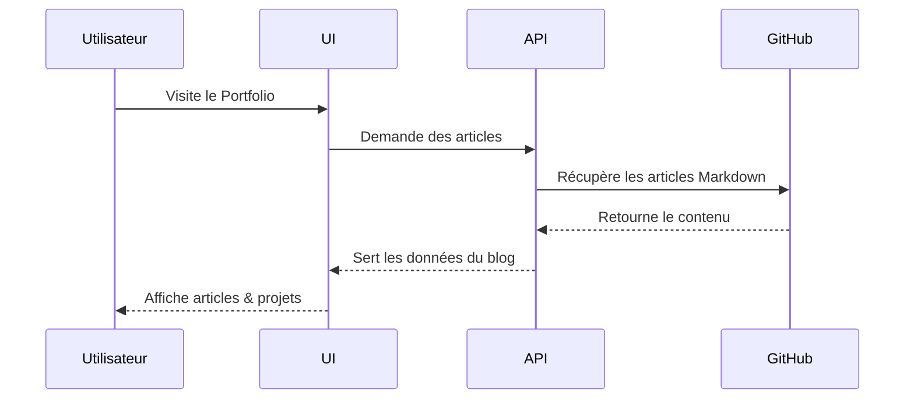

<p align="center">
	<h1 align="center">PortfolioMR</h1>
	<p align="center">
		<strong><a href="https://your-portfolio-link.com">🔴 Live Demo</a></strong>
	</p>
	<p align="center">
		
		
		
	</p>
</p>

> **Note:**  
> 🇬🇧 English section first.  
> 🇫🇷 La section française suit plus bas.

---
## 🇬🇧 English

> **PortfolioMR** is a modern, full-stack developer portfolio built with Next.js, Tailwind CSS, and TypeScript. It features a dynamic blog powered by the GitHub API, interactive UI/UX, and a robust CI/CD pipeline.

---
### 🚀 Features

### 🚀 Quickstart

```bash
git clone https://github.com/Mohammad77Radwan/PortfolioMR.git
cd PortfolioMR
npm install
npm run dev
```

- **Dynamic Blog**: Fetches and displays articles from GitHub.
- **Interactive UI**: Custom animations, counters, and modals.
- **Admin Dashboard**: Secure, role-based content management.
- **CI/CD**: Automated linting, testing, and deployment via GitHub Actions.
- **Responsive Design**: Mobile-first, accessible, and fast.

---
### 🏗️ System Architecture



---
### ⚙️ CI/CD Pipeline Workflow



---
### 🔄 Data Flow / User Journey



---
### 🧰 Tech Stack

| Icon | Technology      | Purpose / Rôle                                      |
|------|-----------------|-----------------------------------------------------|
| ⚡   | **Next.js**     | React framework for SSR, routing, and fast builds   |
| 🎨   | **Tailwind CSS**| Utility-first CSS for rapid UI development          |
| 🟦   | **TypeScript**  | Type safety and better developer experience         |
| 🟣   | **Prisma**      | ORM for type-safe database access                   |
| 🐙   | **GitHub API**  | Dynamic blog content from GitHub repositories       |
| 🚦   | **GitHub Actions** | Automated CI/CD for linting, testing, deployment |
| 🌐   | **Netlify**     | Fast, global deployment and hosting                 |

---
### 📦 Project Structure

> **Note:**  
> Professionally annotated, elite project folder structure.

```plaintext
PORTFOLIOMR/
├── app/                  # Next.js 13+ App Router (core routing & API endpoints)
│   ├── actions/          # Secure server actions (server-side mutations)
│   ├── api/              # Serverless API routes (e.g., contact, blog)
│   │   └── contact/      # Contact API (form handling)
│   │       └── route.ts  # API route for contact form
│   ├── globals.css       # Global application styles
│   ├── layout.tsx        # Root layout & global providers
│   ├── page.tsx          # Main landing page
│   ├── robots.ts         # Dynamic robots.txt
│   └── sitemap.ts        # Sitemap XML generation
├── components/           # Reusable, modular UI components
│   ├── admin/            # Admin dashboard components
│   ├── animations/       # Custom animations and visual effects
│   ├── content/          # Markdown/MDX article rendering
│   ├── social/           # Social media integrations
│   └── ui/               # UI primitives (skeletons, loaders, etc.)
├── actions/              # Global Next.js server actions
├── hooks/                # Custom React hooks
├── lib/                  # Backend utilities (auth, data, Prisma, etc.)
├── public/               # Public static files (images, docs)
│   ├── documents/        # PDF, Excel, and other documents
│   └── projects/         # Project assets (demos, screenshots, logos)
├── types/                # Centralized TypeScript types
├── README.md             # Main documentation (FR/EN)
├── README.en.md          # English documentation
├── package.json          # Project dependencies and scripts
├── tsconfig.json         # TypeScript configuration
├── tailwind.config.js    # Tailwind CSS configuration
└── ...                   # Other config and root files
```

---
## 🇫🇷 Français

> **PortfolioMR** est un portfolio développeur full-stack moderne, construit avec Next.js, Tailwind CSS et TypeScript. Il propose un blog dynamique alimenté par l’API GitHub, une interface interactive, et un pipeline CI/CD robuste.

---
### 🚀 Fonctionnalités

- **Blog Dynamique** : Récupère et affiche les articles depuis GitHub.
- **UI Interactive** : Animations, compteurs et modales personnalisés.
- **Tableau Admin** : Gestion sécurisée et basée sur les rôles.
- **CI/CD** : Lint, tests et déploiement automatisés via GitHub Actions.
- **Design Responsive** : Mobile-first, accessible et rapide.

---
### 🏗️ Architecture du Système



---
### ⚙️ Pipeline CI/CD



---
### 🔄 Flux de Données / Parcours Utilisateur



---
### 🧰 Pile Technologique

| Icône | Technologie      | Rôle / Purpose                                      |
|-------|------------------|-----------------------------------------------------|
| ⚡    | **Next.js**      | Framework React pour SSR, routage, builds rapides   |
| 🎨    | **Tailwind CSS** | CSS utilitaire pour développement UI rapide         |
| 🟦    | **TypeScript**   | Typage statique et expérience développeur améliorée |
| 🟣    | **Prisma**       | ORM pour accès base de données type-safe            |
| 🐙    | **API GitHub**   | Blog dynamique depuis les dépôts GitHub             |
| 🚦    | **GitHub Actions** | CI/CD automatisé pour lint, tests, déploiement   |
| 🌐    | **Netlify**      | Hébergement et déploiement rapide et global         |

---
### 📦 Structure du Projet

> **Note :**  
> Le projet suit une structure modulaire pour la scalabilité et la maintenabilité.

```
/app         # Dossier principal Next.js
/components  # Composants UI réutilisables
/hooks       # Hooks React personnalisés
/lib         # Librairies utilitaires (auth, data, etc.)
/public      # Fichiers statiques
/types       # Types TypeScript
```

---
> **Made with ❤️ by Mohammad Radwan**  
> _For any questions, feel free to open an issue or contact me!_  

---

### 🔐 Environment Variables

| Variable Name      | Required | Description                                      |
|--------------------|----------|--------------------------------------------------|
| `DATABASE_URL`     | Yes      | Database connection string for Prisma            |
| `GITHUB_TOKEN`     | No       | GitHub token to increase API rate limits         |
| `FORM_API_KEY`     | No       | API key for contact form integration             |
>  
> **Réalisé avec ❤️ par Mohammad Radwan**  
> _Pour toute question, ouvrez une issue ou contactez-moi !_
# Portfolio MR - BTS SIO SLAM (Session 2026)

[Français](README.md) | [English](README.en.md)

Main repository for Mohammad Radwan's professional and academic portfolio.

This repository centralizes:
- the modern web portfolio (Next.js),
- E4/E5 compliance documentation,
- BTS SIO competency evidence,
- project, internship, certification, and CV resources.

## Repository goals

This repository has two primary goals:
1. Provide clear and auditable evidence for BTS SIO assessment (CCF E4/E5).
2. Present a strong technical profile for further studies and hiring.

## Quick contents

- [Overview](#overview)
- [Quick start](#quick-start)
- [Repository structure](#repository-structure)
- [Main web portfolio](#main-web-portfolio)
- [E4E5 documentation](#e4e5-documentation)
- [Projects and technical evidence](#projects-and-technical-evidence)
- [Compliance checklist](#compliance-checklist)
- [Recommended workflow](#recommended-workflow)
- [Roadmap](#roadmap)
- [Contact](#contact)

## Overview

Main entry points:
- [portfolio-next](portfolio-next/README.md): primary Next.js portfolio app
- [index.html](index.html): static portfolio version
- [documentation](documentation/README.md): E4/E5 documentation hub
- [projets](projets/README.md): project folders and templates
- [stages](stages/README.md): internship evidence
- [certifications](certifications/README.md): technical certifications
- [cv](cv/README.md): CV resources
- [medias](medias/README.md): visual assets

## Quick start

### Requirements
- Node.js 20+
- npm 10+
- Git

### Run the Next.js portfolio
```bash
cd /workspaces/Portfolio-MR/portfolio-next
npm install
npm run dev
```

Then open: [http://localhost:3000](http://localhost:3000)

### Build verification
```bash
cd /workspaces/Portfolio-MR/portfolio-next
npm run lint
npm run build
```

## Repository structure

```text
Portfolio-MR/
|-- README.md
|-- README.en.md
|-- index.html
|-- assets/
|-- portfolio-next/
|   |-- app/
|   |-- components/
|   |-- lib/
|   |-- public/
|   |-- types/
|   `-- README.md
|-- documentation/
|   |-- README.md
|   |-- CHECKLIST-CONFORMITE-E4-E5.md
|   |-- E5-EXIGENCES-OFFICIELLES.md
|   |-- competences/
|   |-- cybersecurite/
|   |-- diaporama/
|   |-- evaluation/
|   |-- oral/
|   |-- tableau-synthese/
|   `-- veille-technologique/
|-- projets/
|   |-- README.md
|   `-- _template/
|-- stages/
|-- certifications/
|-- cv/
`-- medias/
```

## Main web portfolio

The main app is [portfolio-next](portfolio-next/README.md).

Core stack:
- Next.js 16
- React 19
- TypeScript
- Tailwind CSS v4
- Framer Motion
- Zod

Main functional sections:
- Advanced hero
- Animated stats
- Bento projects with modal details
- Skills / Experience / Testimonials / Blog
- Live GitHub section
- Downloadable E5 documents
- Newsletter
- Contact form with server-side validation

Important public assets:
- Jury documents: [portfolio-next/public/documents](portfolio-next/public/documents)
- Project visuals: [portfolio-next/public/projects](portfolio-next/public/projects)
- Social preview: [portfolio-next/public/og-cover.svg](portfolio-next/public/og-cover.svg)

## E4E5 documentation

Entry point: [documentation/README.md](documentation/README.md)

Critical documents:
- Official requirements: [documentation/E5-EXIGENCES-OFFICIELLES.md](documentation/E5-EXIGENCES-OFFICIELLES.md)
- Compliance checklist: [documentation/CHECKLIST-CONFORMITE-E4-E5.md](documentation/CHECKLIST-CONFORMITE-E4-E5.md)
- BTS competencies: [documentation/competences/BLOCS-BTS-SIO-COMPETENCES-SAVOIRS.md](documentation/competences/BLOCS-BTS-SIO-COMPETENCES-SAVOIRS.md)
- Summary table: [documentation/tableau-synthese/README.md](documentation/tableau-synthese/README.md)
- Oral script: [documentation/oral/SCRIPT-ORAL-10-MIN.md](documentation/oral/SCRIPT-ORAL-10-MIN.md)
- Jury questions: [documentation/oral/QUESTIONS-JURY-30-QA.md](documentation/oral/QUESTIONS-JURY-30-QA.md)
- Evaluation annexes: [documentation/evaluation/README.md](documentation/evaluation/README.md)

## Projects and technical evidence

Entry point: [projets/README.md](projets/README.md)

Standard template:
- [projets/_template/README-projet-template.md](projets/_template/README-projet-template.md)

The template includes:
- context and objectives,
- architecture and technical choices,
- BTS competency mapping,
- security,
- testing,
- challenges and lessons learned.

## Compliance checklist

Before jury submission, verify at least:
1. E5 document links are working.
2. Internship documents are present and final.
3. The competency summary table is complete and consistent.
4. The portfolio runs locally with no errors.
5. Production build succeeds (`npm run build`).
6. Mobile navigation is usable.
7. BTS evidence is explicit in each project.

## Recommended workflow

1. Update content in [portfolio-next/lib/data.ts](portfolio-next/lib/data.ts).
2. Add or replace visuals in [portfolio-next/public/projects](portfolio-next/public/projects).
3. Add final official documents to [portfolio-next/public/documents](portfolio-next/public/documents).
4. Run lint/build checks.
5. Update E4/E5 documentation when evidence changes.
6. Commit with clear messages.

## Roadmap

- Replace PDF placeholders with final signed files.
- Replace placeholder project visuals with final screenshots.
- Add a full English app version (optional).
- Add lightweight analytics/observability (optional).

## Contact

- GitHub: [Mohammad77Radwan](https://github.com/Mohammad77Radwan)
- Email: mohammadradwn804@gmail.com
- LinkedIn: Mohammad Radwan

---

If this is your first time in this repository, start with [portfolio-next/README.md](portfolio-next/README.md) for technical run instructions, then [documentation/README.md](documentation/README.md) for E4/E5 scope.
