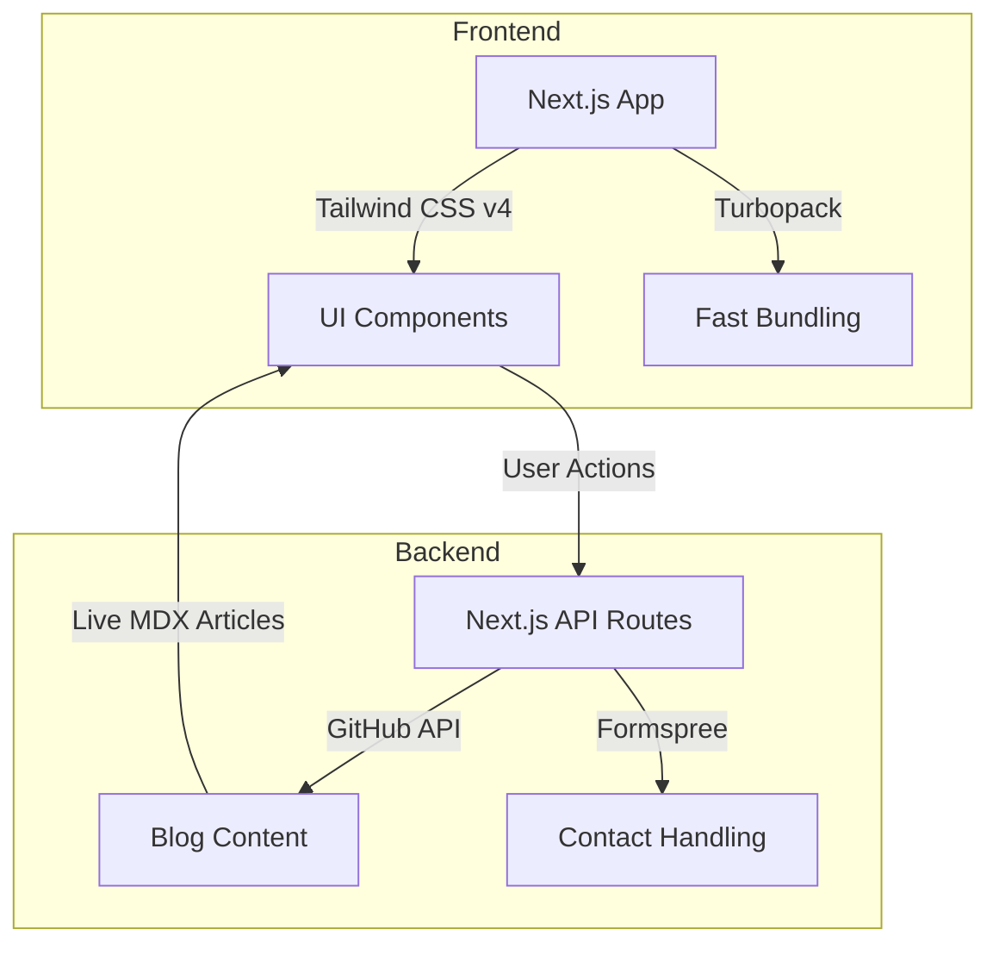
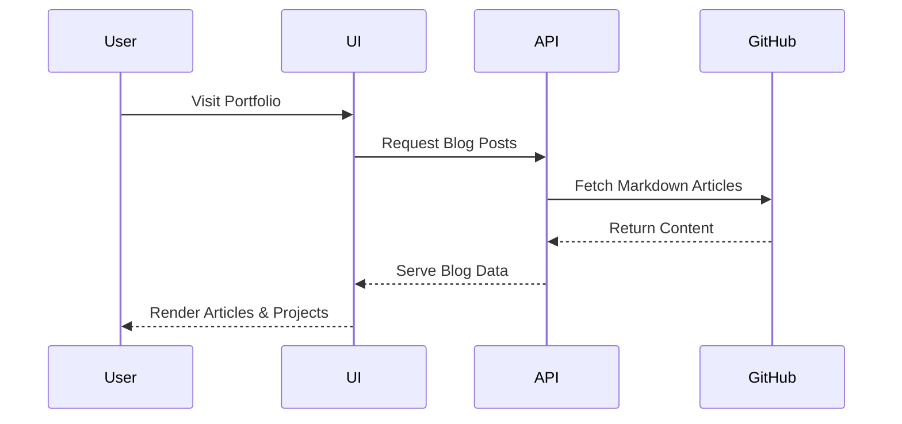
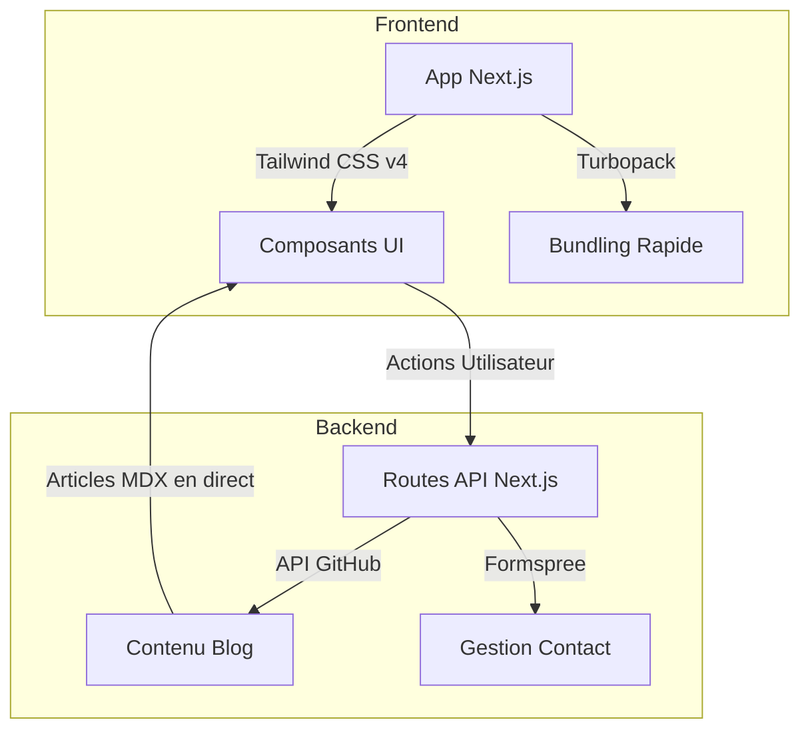
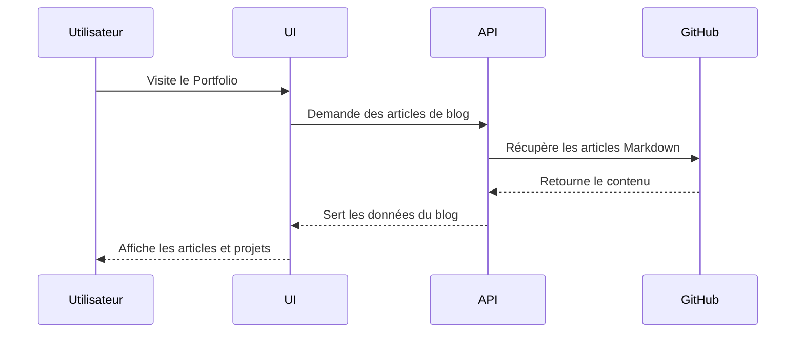

<p align="center">
  <h1 align="center">PortfolioMR - Advanced Developer Portfolio</h1>
  <p align="center">
    <strong><a href="https://mohammadradwanportfolio.netlify.app/">🔴 View Live Demo / Voir le Site en Direct</a></strong>
  </p>
  <p align="center">
    
    
    
    
  </p>
</p>

> **Note:**
> 🇬🇧 English documentation first. 
> 🇫🇷 La documentation en français suit plus bas.

---

## 🇬🇧 English

## 🚀 Overview

**PortfolioMR** is the main repository for Mohammad Radwan's professional and academic profile. Built with Next.js, Tailwind CSS, and TypeScript, it serves a dual purpose:
1. **A modern, production-grade web portfolio** featuring a dynamic blog powered by the GitHub API and an interactive UI.
2. **An official academic repository** centralizing E4/E5 compliance documentation and competency evidence for the BTS SIO SLAM (Session 2026) degree.

---

## ⚡ Quickstart

```bash
# 1. Clone the repository
git clone [https://github.com/Mohammad77Radwan/PortfolioMR.git](https://github.com/Mohammad77Radwan/PortfolioMR.git)

# 2. Navigate to the Next.js app
cd PortfolioMR/portfolio-next

# 3. Install dependencies
npm install

# 4. Start the development server
npm run dev
```

---

## 🏗️ System Architecture



---

## 🔄 Data Flow / User Journey



---

## 🧰 Tech Stack

| Icon | Technology       | Purpose / Role                                      |
|------|------------------|-----------------------------------------------------|
| ⚡   | **Next.js 16** | React framework for SSR, routing, and fast builds   |
| 🎨   | **Tailwind CSS** | Utility-first CSS for rapid, responsive UI design   |
| 🟦   | **TypeScript** | Type safety and scalable developer experience       |
| 🎬   | **Framer Motion**| Fluid layout animations and page transitions        |
| 🐙   | **GitHub API** | Dynamic blog content pulled directly from repos     |
| 🚦   | **GitHub Actions**| Automated CI/CD for linting, testing, deployment   |
| 🌐   | **Netlify** | Fast, global deployment and edge hosting            |

---

## 🔐 Environment Variables

To run the Next.js app locally with full functionality, create a `.env.local` file in the `portfolio-next/` directory:

| Variable Name      | Required | Description                                      |
|--------------------|----------|--------------------------------------------------|
| `GITHUB_TOKEN`     | No       | GitHub PAT to increase API rate limits for the blog |
| `NEXT_PUBLIC_FORM` | Yes      | Formspree (or equivalent) endpoint for contact form |

---

## 📦 Master Project Structure

> **Architectural Note:**
> This repository is structured as a monorepo, cleanly separating the Next.js web application from academic documentation and static assets.

```text
Portfolio-MR/
├── portfolio-next/             # Main Next.js Web Application
│   ├── app/                    # Next.js 13+ App Router (Pages & API)
│   ├── components/             # Reusable UI components (Bento grid, Modals)
│   ├── lib/                    # Core utilities (Data fetching, Types)
│   ├── public/                 # Static web assets (Images, SVGs)
│   └── tailwind.config.js      # Theme & styling configuration
├── documentation/              # 🎓 BTS SIO E4/E5 Compliance Hub
│   ├── competences/            # BTS competency mapping
│   ├── evaluation/             # Jury evaluation annexes
│   └── CHECKLIST-CONFORMITE.md # Exam checklist
├── projets/                    # Technical evidence & project templates
├── stages/                     # Internship documentation and reports
├── certifications/             # Technical certifications & badges
├── cv/                         # Resumes in multiple formats
└── README.md / README.en.md    # Repository entry points
```

---


---

<br>
<br>

---

## 🇫🇷 Français

## 🚀 Vue d'ensemble

**PortfolioMR** est le dépôt principal regroupant le profil professionnel et académique de Mohammad Radwan. Construit avec Next.js, Tailwind CSS et TypeScript, il remplit un double objectif :
1. **Un portfolio web moderne de niveau production**, incluant un blog dynamique alimenté par l'API GitHub et une interface utilisateur interactive.
2. **Un dépôt académique officiel** centralisant la documentation de conformité E4/E5 et les preuves de compétences pour le diplôme de BTS SIO SLAM (Session 2026).

---

## ⚡ Démarrage Rapide

```bash
# 1. Cloner le dépôt
git clone [https://github.com/Mohammad77Radwan/PortfolioMR.git](https://github.com/Mohammad77Radwan/PortfolioMR.git)

# 2. Accéder à l'application Next.js
cd PortfolioMR/portfolio-next

# 3. Installer les dépendances
npm install

# 4. Lancer le serveur de développement
npm run dev
```

---

## 🏗️ Architecture du Système



---

## 🔄 Flux de Données / Parcours Utilisateur



---

## 🧰 Pile Technologique

| Icône | Technologie      | Rôle / Objectif                                     |
|-------|------------------|-----------------------------------------------------|
| ⚡    | **Next.js 16** | Framework React (SSR, routage, builds ultra-rapides)|
| 🎨    | **Tailwind CSS** | CSS utilitaire pour des interfaces responsives      |
| 🟦    | **TypeScript** | Typage statique et expérience développeur sécurisée |
| 🎬    | **Framer Motion**| Animations fluides et transitions de pages          |
| 🐙    | **API GitHub** | Blog dynamique récupérant les articles depuis GitHub|
| 🚦    | **GitHub Actions**| CI/CD automatisé (linting, tests, déploiement)     |
| 🌐    | **Netlify** | Hébergement Edge et déploiement global rapide       |

---

## 🔐 Variables d'Environnement

Pour exécuter l'application Next.js localement avec toutes ses fonctionnalités, créez un fichier `.env.local` dans le dossier `portfolio-next/` :

| Nom de la Variable | Requise | Description                                      |
|--------------------|---------|--------------------------------------------------|
| `GITHUB_TOKEN`     | Non     | Token GitHub pour augmenter les limites d'API    |
| `NEXT_PUBLIC_FORM` | Oui     | Endpoint Formspree pour le formulaire de contact |

---

## 📦 Structure Globale du Projet

> **Note d'Architecture :**
> Ce dépôt est structuré comme un monorepo, séparant proprement l'application web Next.js de la documentation académique et des fichiers statiques.

```text
Portfolio-MR/
├── portfolio-next/             # Application Web Principale (Next.js)
│   ├── app/                    # App Router Next.js 13+ (Pages & API)
│   ├── components/             # Composants UI (Bento grid, Modales)
│   ├── lib/                    # Utilitaires (Fetch de données, Types)
│   ├── public/                 # Assets web statiques (Images, SVGs)
│   └── tailwind.config.js      # Configuration du style et du thème
├── documentation/              # 🎓 Centre de Conformité BTS SIO E4/E5
│   ├── competences/            # Cartographie des compétences BTS
│   ├── evaluation/             # Annexes d'évaluation pour le jury
│   └── CHECKLIST-CONFORMITE.md # Liste de vérification pour l'examen
├── projets/                    # Preuves techniques et templates de projets
├── stages/                     # Documentation et rapports de stage
├── certifications/             # Certifications techniques et badges
├── cv/                         # CV sous différents formats
└── README.md / README.en.md    # Points d'entrée du dépôt
```

---


---

> **Made with ❤️ by Mohammad Radwan** > _For any questions, feel free to open an issue or contact me!_
