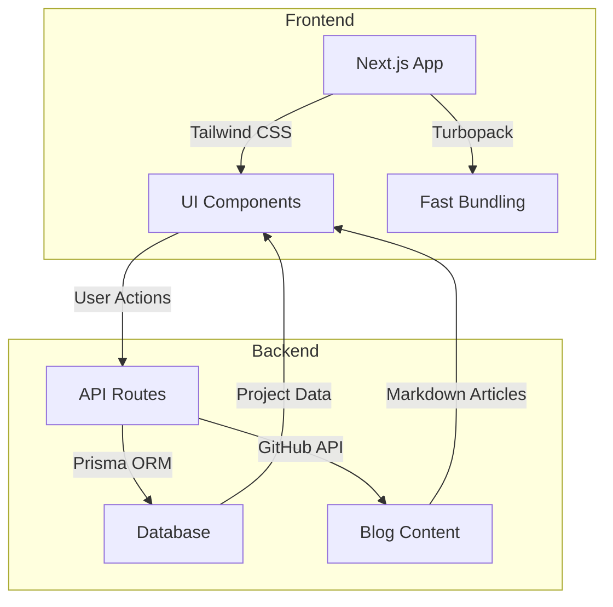
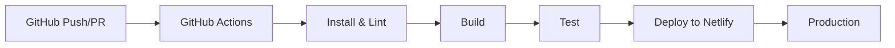
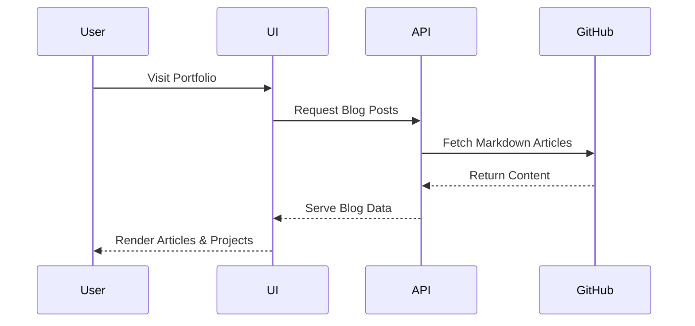
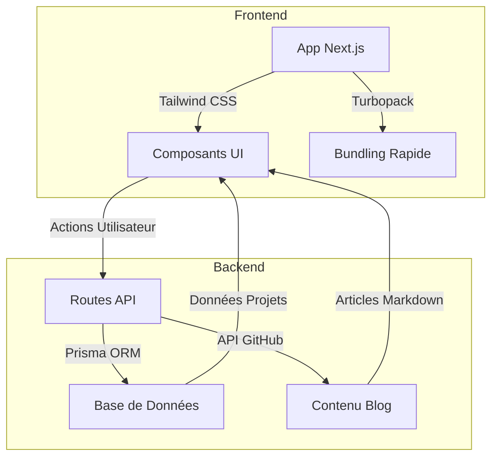
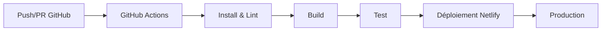
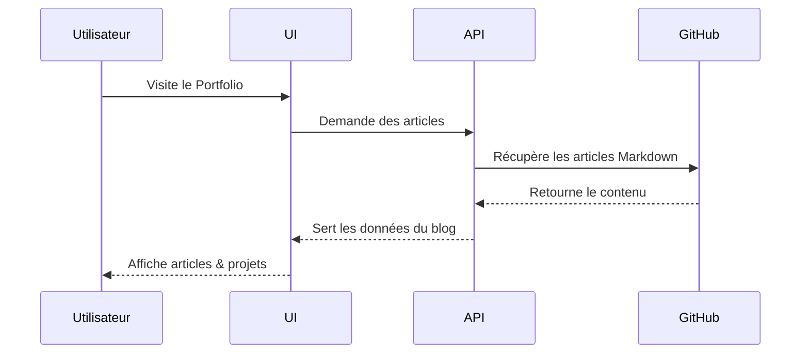

# PortfolioMR


> **Note:**  
> 🇬🇧 English section first.  
> 🇫🇷 La section française suit plus bas.

---

## 🇬🇧 English

> **PortfolioMR** is a modern, full-stack developer portfolio built with Next.js, Tailwind CSS, and TypeScript. It features a dynamic blog powered by the GitHub API, interactive UI/UX, and a robust CI/CD pipeline.

---

### 🚀 Features

- **Dynamic Blog**: Fetches and displays articles from GitHub.
- **Interactive UI**: Custom animations, counters, and modals.
- **Admin Dashboard**: Secure, role-based content management.
- **CI/CD**: Automated linting, testing, and deployment via GitHub Actions.
- **Responsive Design**: Mobile-first, accessible, and fast.

---

### 🏗️ System Architecture



---

### ⚙️ CI/CD Pipeline Workflow



---

### 🔄 Data Flow / User Journey



---

### 🧰 Tech Stack

| Icon | Technology      | Purpose / Rôle                                      |
|------|-----------------|-----------------------------------------------------|
| ⚡   | **Next.js**     | React framework for SSR, routing, and fast builds   |
| 🎨   | **Tailwind CSS**| Utility-first CSS for rapid UI development          |
| 🟦   | **TypeScript**  | Type safety and better developer experience         |
| 🟣   | **Prisma**      | ORM for type-safe database access                   |
| 🐙   | **GitHub API**  | Dynamic blog content from GitHub repositories       |
| 🚦   | **GitHub Actions** | Automated CI/CD for linting, testing, deployment |
| 🌐   | **Netlify**     | Fast, global deployment and hosting                 |

---

### 📦 Project Structure

> **Note :**  
> Arborescence professionnelle et annotée du projet.

```plaintext
PORTFOLIOMR/
├── app/                  # App Next.js 13+ (routage, endpoints API)
│   ├── actions/          # Actions serveur sécurisées (mutations côté serveur)
│   ├── api/              # Routes API serverless (ex: contact, blog)
│   │   └── contact/      # API de contact (traitement des formulaires)
│   │       └── route.ts  # Route API pour le formulaire de contact
│   ├── globals.css       # Styles globaux de l’application
│   ├── layout.tsx        # Layout racine & providers globaux
│   ├── page.tsx          # Page principale (accueil)
│   ├── robots.ts         # Fichier robots.txt dynamique
│   └── sitemap.ts        # Génération du sitemap XML
├── components/           # Composants UI réutilisables et modulaires
│   ├── admin/            # Composants du dashboard administrateur
│   ├── animations/       # Animations et effets visuels personnalisés
│   ├── content/          # Rendu des articles Markdown/MDX
│   ├── social/           # Intégrations réseaux sociaux
│   └── ui/               # Primitives UI (squelettes, loaders, etc.)
├── actions/              # Actions serveur Next.js globales
├── hooks/                # Hooks React personnalisés
├── lib/                  # Utilitaires backend (auth, data, Prisma, etc.)
├── public/               # Fichiers statiques accessibles (images, docs)
│   ├── documents/        # Documents PDF, Excel, etc.
│   └── projects/         # Assets projets (démos, screenshots, logos)
├── types/                # Types TypeScript centralisés
├── README.md             # Documentation principale (FR/EN)
├── README.en.md          # Documentation anglaise
├── package.json          # Dépendances et scripts du projet
├── tsconfig.json         # Configuration TypeScript
├── tailwind.config.js    # Configuration Tailwind CSS
└── ...                   # Autres fichiers de configuration et racine
```

---

## 🇫🇷 Français

> **PortfolioMR** est un portfolio développeur full-stack moderne, construit avec Next.js, Tailwind CSS et TypeScript. Il propose un blog dynamique alimenté par l’API GitHub, une interface interactive, et un pipeline CI/CD robuste.

---

### 🚀 Fonctionnalités

- **Blog Dynamique** : Récupère et affiche les articles depuis GitHub.
- **UI Interactive** : Animations, compteurs et modales personnalisés.
- **Tableau Admin** : Gestion sécurisée et basée sur les rôles.
- **CI/CD** : Lint, tests et déploiement automatisés via GitHub Actions.
- **Design Responsive** : Mobile-first, accessible et rapide.

---

### 🏗️ Architecture du Système



---

### ⚙️ Pipeline CI/CD



---

### 🔄 Flux de Données / Parcours Utilisateur



---

### 🧰 Pile Technologique

| Icône | Technologie      | Rôle / Purpose                                      |
|-------|------------------|-----------------------------------------------------|
| ⚡    | **Next.js**      | Framework React pour SSR, routage, builds rapides   |
| 🎨    | **Tailwind CSS** | CSS utilitaire pour développement UI rapide         |
| 🟦    | **TypeScript**   | Typage statique et expérience développeur améliorée |
| 🟣    | **Prisma**       | ORM pour accès base de données type-safe            |
| 🐙    | **API GitHub**   | Blog dynamique depuis les dépôts GitHub             |
| 🚦    | **GitHub Actions** | CI/CD automatisé pour lint, tests, déploiement   |
| 🌐    | **Netlify**      | Hébergement et déploiement rapide et global         |

---

### 📦 Structure du Projet

> **Note :**  
> Le projet suit une structure modulaire pour la scalabilité et la maintenabilité.

```
/app         # Dossier principal Next.js
/components  # Composants UI réutilisables
/hooks       # Hooks React personnalisés
/lib         # Librairies utilitaires (auth, data, etc.)
/public      # Fichiers statiques
/types       # Types TypeScript
```

---

> **Made with ❤️ by Mohammad Radwan**  
> _For any questions, feel free to open an issue or contact me!_  
>  
> **Réalisé avec ❤️ par Mohammad Radwan**  
> _Pour toute question, ouvrez une issue ou contactez-moi !_